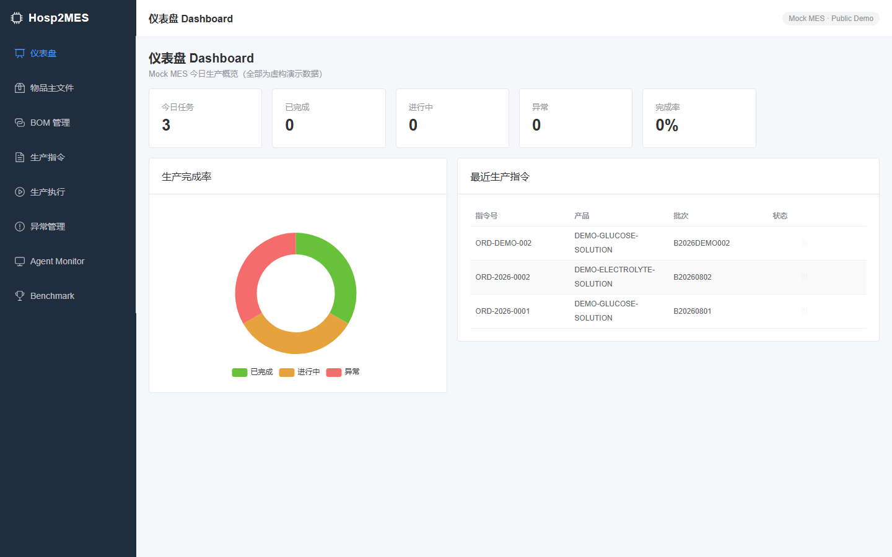
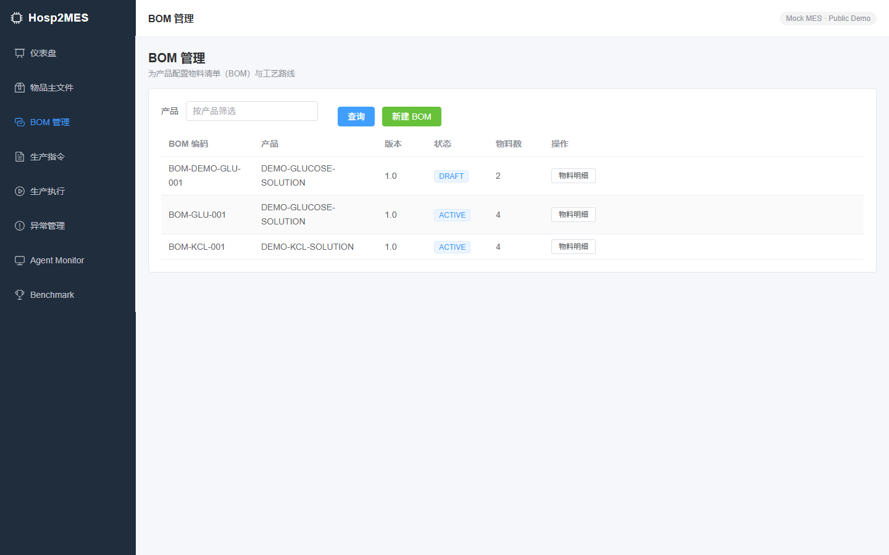
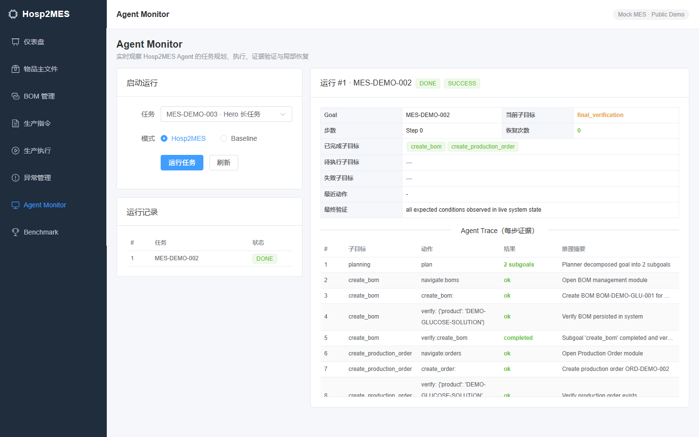
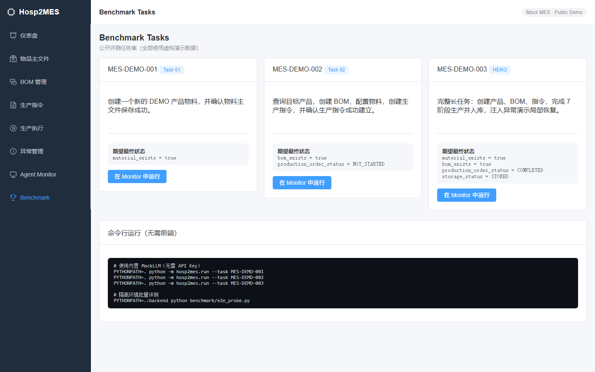
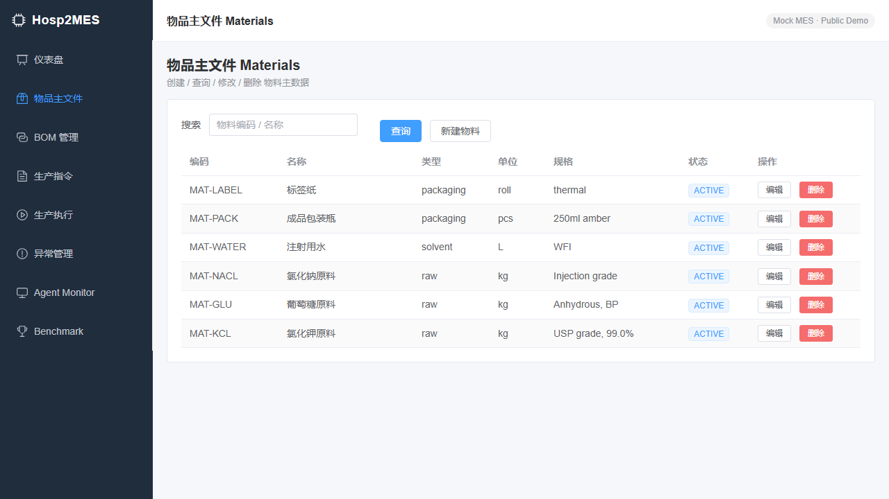
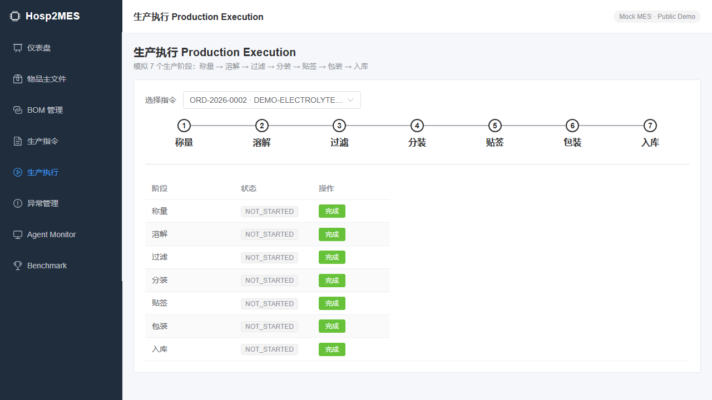

# Hosp2MES-Agent-Public

> 一个面向制造执行系统(MES)的长周期 GUI Agent 公开演示项目。

[](https://www.python.org/)
[](https://vuejs.org/)
[](https://fastapi.tiangolo.com/)
[](https://playwright.dev/)
[](LICENSE)

**Hosp2MES** 演示了如何让 Agent 在 MES 业务系统中完成端到端长周期任务:创建物料主文件 → 配置 BOM 与工艺路线 → 下达生产指令 → 完成七阶段生产 → 入库。项目包含一个可独立运行的 Mock MES 后端、一个 Vue 3 可视化控制台、一个模块化 Agent 框架,以及公开基准任务。

**关键点**:Agent 的公开 Hero Demo 支持**两种执行模式**——一种通过 REST API 的确定性测试后端,一种通过真实浏览器 GUI(Playwright)驱动 Vue 页面完成观察、定位、点击、输入、选择与等待。全部数据均为虚构演示数据,不含任何真实医院或工厂信息。



---

## ✨ 核心特性

- **长周期规划(Long-Horizon Planning)**:将高层目标自动分解为可执行子目标。
- **结构化进度记忆(Structured Progress Memory)**:显式记录已完成/待执行/失败子目标,不依赖对话历史。
- **证据门控验证(Evidence-Gated Verification)**:每步执行后读取真实后端状态验证,不盲信 Agent 自评。
- **局部恢复(Local Recovery)**:遇到注入异常时重试/补偿,而不是重启整段任务。
- **Agent Trace 与 Monitor**:每步动作、结果、推理摘要实时发布到前端。
- **MockLLM 回退**:无需 API Key 即可运行完整 E2E 评测。
- **真实浏览器 GUI 执行(BrowserEnv)**:基于 Playwright 打开 Vue Mock MES,通过语义定位(role + accessible name / label / text)执行业务操作,并输出 before/after 截图与逐步证据。
- **公开基准**:MES-DEMO-001/002/003 + MES-DEMO-GUI-001,覆盖简单创建、标准流程、长周期+恢复、真实 GUI 场景。

---

## 🧭 两种执行模式

| 维度 | `ApiEnv`(api 模式) | `BrowserEnv`(browser 模式) |
|------|---------------------|-----------------------------|
| 执行方式 | 通过 Mock MES REST API 调用 | 真实打开 Vue 页面,Playwright GUI 操作 |
| 观察来源 | REST 返回的业务数据 | 网页 DOM / 语义信息 + 截图 |
| 用途 | **确定性测试 / CI backend** | **真实 GUI 执行(Hero Demo)** |
| 需要浏览器 | 否 | 是(`playwright install chromium`) |
| 业务状态验证 | 读取后端状态 | **独立** 只读 ApiEnv 回读(子目标完成检查 + 最终业务状态验证) |

> ⚠️ **ApiEnv 模式不等于"完整 GUI Agent"。** 它是确定性测试与 CI 的后端。真正打开页面、观察、点击、输入、选择的 GUI Agent 能力由 `BrowserEnv` + `BrowserExecutor` 提供。

> REST API 不参与 GUI 动作决策，也不修改 MES 业务状态，仅作为独立只读验证器，用于子目标完成检查和最终业务状态验证。(REST API does not participate in GUI action decisions or business-state mutation. It is used only as an independent read-only verifier for subgoal completion checks and final-state verification.)

---

## 🚀 快速开始(从全新 clone 开始,无需任何预设本地路径)

```bash
# 1. 克隆
git clone https://github.com/Ctrl-CV-Master/Hosp2MES-Agent-Public.git
cd Hosp2MES-Agent-Public

# 2. 创建虚拟环境并安装后端 + Agent 依赖(含 Playwright)
python -m venv .venv
# Windows:
.venv\Scripts\activate
# macOS / Linux:
# source .venv/bin/activate

pip install -r backend/requirements.txt
playwright install chromium

# 3. 安装并启动前端
cd frontend
npm install
npm run dev
# 打开 http://127.0.0.1:5173
```

另开一个终端启动后端:

```bash
# 回到仓库根目录(虚拟环境已激活)
cd backend
uvicorn app.main:app --reload --port 8000
```

后端 Swagger UI: `http://127.0.0.1:8000/docs`

### 运行 Agent(命令行)

**api 模式(确定性测试 / CI,默认):**

```bash
# 在仓库根目录
PYTHONPATH=.:backend python -m hosp2mes.run --task MES-DEMO-001 --env api
```

**browser 模式(真实 GUI,需先启动前端 + 后端):**

```bash
# 有头浏览器,可直接观察 Agent 操作页面
python -m hosp2mes.run --task MES-DEMO-GUI-001 --env browser --headless false

# 无头(CI)
python -m hosp2mes.run --task MES-DEMO-GUI-001 --env browser --headless true

# 选择 browser 模式的 Agent(默认 skill 基线)
python -m hosp2mes.run --task MES-DEMO-GUI-001 --env browser --agent hosp2mes --policy deterministic
python -m hosp2mes.run --task MES-DEMO-GUI-001 --env browser --agent hosp2mes --policy llm
python -m hosp2mes.run --task MES-DEMO-GUI-001 --env browser --agent hosp2mes --policy llm-strict  # 需 .env 真实 DeepSeek key
python -m hosp2mes.run --task MES-DEMO-GUI-001 --env browser --agent s3   # 需 gui-agents + 凭据
```

可用任务:`MES-DEMO-001`、`MES-DEMO-002`、`MES-DEMO-003`、`MES-DEMO-GUI-001`。

> 浏览器模式会在 `artifacts/runs/<run_id>/` 输出 `steps.json`(逐步 GUI 动作 + 观察摘要)、`summary.json`(最终验证结果与诚实状态)以及每一步的 before/after PNG 截图。

---

## 🤖 三种 Agent

| Agent | 文件 | 决策方式 |
|-------|------|----------|
| **SemanticSkillAgent**(Skill 基线) | `hosp2mes/agents/skill_agent.py` | 每个 subgoal 一段**预写**的语义 GUI 动作序列(确定性 baseline) |
| **Hosp2MESAgent**(LLM action policy) | `hosp2mes/agents/hosp2mes_agent.py` | **每轮只预测一个** next action:`GOAL+SUBGOAL+MEMORY+OBSERVATION → policy → 一个动作 → 执行 → 再观察` |
| **Agent S3**(外部框架) | `hosp2mes/agents/agent_s3_adapter.py` | 官方 [Agent S3](https://github.com/simular-ai/Agent-S)(Apache-2.0,`gui-agents`)的适配器 |

- `SemanticSkillAgent` 是 V1.1 `BrowserAgent` 的重命名定位,作为确定性 GUI baseline 保留(`BrowserAgent` 仍是兼容别名)。
- `Hosp2MESAgent` 是真正的 decision loop,不一次输出整段动作序列;策略输出严格结构化 `{action, target, value, rationale}`,不含私有 chain-of-thought。策略有三种 `--policy` 模式:`deterministic`(总是 fallback)、`llm`(真实 LLM,失败允许 fallback 但每步记录 provenance)、`llm-strict`(只允许真实 LLM,任何失败立即 FAIL,严禁 fallback)。
- `AgentS3Adapter` 桥接真实 `AgentS3.predict()`(screenshot 观察 → 预测动作)。真实运行需要 `pip install gui-agents`(Python ≤3.12)+ LLM API Key + UI-TARS grounding 模型端点;本仓库**不伪造**其成功结果。

### 验证状态(真实结果,非笼统声明)

| Agent / Policy | 状态 | 依据 |
|----------------|------|------|
| SemanticSkillAgent(Skill 基线) | ✅ PASS | Hero 全流程 GUI 通过,独立验证 COMPLETED/STORED |
| Hosp2MESAgent `deterministic` | ✅ PASS | `test_agent_policy` + GUI-001 通过 |
| Hosp2MESAgent DeepSeek GUI-001(`llm-strict`) | ✅ PASS | `MES-DEMO-GUI-001-20260822T151624Z`:8 步全 `deepseek`、`fallback=0`、`material_exists=true` |
| Hosp2MESAgent DeepSeek Variant(`llm-strict`) | ✅ PASS | 页面变体(字段重排 + 干扰按钮)6 步全 `deepseek`,填对全部字段 |
| Hosp2MESAgent DeepSeek Hero(`llm-strict`) | ✅ PASS | `MES-DEMO-003-20260823T011158Z`:31 步全 `deepseek`、`fallback=0`、`material_exists/bom_exists=true`、`production_order_status=COMPLETED`、`storage_status=STORED`、`4/4` subgoals |
| Agent S3 | adapter ready / runtime not yet evaluated | 真实 import/construct 已验证;真实 `predict()` 需要 LLM Key + UI-TARS grounding 端点(本环境缺失) |

> Hero 真实证据见 `artifacts/runs/MES-DEMO-003-20260823T011158Z/`(31 步 `steps.json` + `summary.json` + 31×before/after 截图;每步含 `policy_source`/`llm_model`/`llm_latency_ms`/`fallback_used`/`decision_rationale`/`memory_snapshot`)。上下文审计见 [LONG_HORIZON_CONTEXT_AUDIT.md](LONG_HORIZON_CONTEXT_AUDIT.md)。

---

## 📊 运行基准评测

```bash
cd <repo-root>
PYTHONPATH=.:backend python benchmark/e2e_probe.py
```

最新验证结果:

| 任务 | 模式 | success | 说明 |
|------|------|---------|------|
| MES-DEMO-001 | api | ✅ | 物料创建 |
| MES-DEMO-002 | api | ✅ | BOM + 生产指令 |
| MES-DEMO-003(Hero) | api | ✅ | 全流程 + 局部恢复(recovery=1) |
| MES-DEMO-GUI-001 | browser | ✅ | 通过 Playwright GUI 创建物料 |
| MES-DEMO-003(Hero) | browser | ✅ | 通过 GUI 完成 物料→BOM→指令→7阶段→入库,独立验证通过 |

> Browser 模式下的完整 Hero 任务(MES-DEMO-003)已跑通,真实证据见 [DEVELOPMENT_STATUS.md](DEVELOPMENT_STATUS.md) 与 `artifacts/runs/<run_id>/`。

---

## 🧪 运行测试

```bash
cd <repo-root>
# Windows:
.venv\Scripts\python.exe -m pytest tests/ -q
# macOS / Linux:
# .venv/bin/python -m pytest tests/ -q
```

- 后端 CRUD 与业务逻辑
- Agent Planner / Memory / Verifier / Recovery / Evaluator 单元测试
- api 模式完整 E2E(临时后端 + Agent 完成 DEMO 任务)
- **Browser 模式**:`test_browser_observation`、`test_browser_executor`、`test_gui_material_creation_e2e`、`test_gui_production_execution`(真实启动页面并通过 Playwright 操作,含 scoped semantic target 与重渲染后 locator 重新获取)
- **Agent policy**:`test_agent_policy`(单步动作决策、页面变体自主性、Hosp2MESAgent 完成 GUI-001)、`test_agent_s3_adapter`(Agent S3 适配器的诚实可用性/映射)

当前共 **42 个测试**全部通过。

---

## 🏗️ 技术栈

| 层级 | 技术 |
|------|------|
| 前端 | Vue 3 + TypeScript + Vite + Element Plus + ECharts + Axios |
| 后端 | Python + FastAPI + SQLAlchemy + SQLite + Pydantic |
| Agent | 模块化 Skill + MockLLM/DeepSeek + ApiEnv(REST,确定性测试) + BrowserEnv(Playwright 真实 GUI) |
| 评测 | pytest + 自定义 E2E Harness |

---

## 📁 项目结构

```
Hosp2MES-Agent-Public/
├── backend/              # FastAPI + SQLite Mock MES
│   ├── app/
│   │   ├── routers/      # REST API
│   │   ├── services/     # 业务逻辑
│   │   ├── models.py     # SQLAlchemy 模型
│   │   ├── schemas.py    # Pydantic 模型
│   │   ├── seed.py       # 演示数据
│   │   └── main.py       # FastAPI 入口
│   └── requirements.txt
├── frontend/             # Vue 3 控制台
│   └── src/
│       ├── views/        # Dashboard / Materials / BOMs / Orders /
│       │                 # Execution / Anomalies / AgentMonitor / Benchmark
│       ├── api/          # Axios 封装
│       └── router/       # Vue Router
├── hosp2mes/             # Agent 框架
│   ├── agent/
│   │   ├── agent.py      # ApiEnv 模式编排
│   │   └── browser_agent.py   # BrowserAgent = SemanticSkillAgent 别名
│   ├── agents/           # 三种 browser 模式 Agent
│   │   ├── skill_agent.py      # SemanticSkillAgent(Skill 基线)
│   │   ├── hosp2mes_agent.py   # Hosp2MESAgent(单步 LLM action policy)
│   │   └── agent_s3_adapter.py # Agent S3(官方 gui-agents)适配器
│   ├── planner/
│   ├── memory/
│   ├── observation/
│   │   ├── api_env.py           # REST 环境(确定性测试/CI)
│   │   ├── browser_env.py       # Playwright 真实 GUI 环境
│   │   ├── browser_observation.py  # 结构化浏览器观察
│   │   └── dom_extractor.py     # DOM/可访问性语义提取
│   ├── executor/
│   │   ├── executor.py          # REST 动作层
│   │   └── browser_executor.py  # GUI 动作层(语义定位)
│   ├── evidence/         # artifacts/runs/<run_id> 逐步证据
│   ├── verifier/
│   ├── recovery/
│   ├── trace/
│   ├── evaluation/
│   ├── run.py            # CLI(--env api|browser --headless ...)
│   └── llm.py
├── benchmark/            # 基准任务与评测脚本
├── artifacts/runs/       # (运行生成)GUI 逐步证据与截图
├── tests/                # pytest 测试
├── docs/                 # 设计文档
├── assets/screenshots/   # 演示截图
└── README.md
```

---

## 📸 界面截图

| 仪表盘 | BOM 管理 | Agent Monitor | Benchmark |
|--------|----------|---------------|-----------|
|  |  |  |  |

### Browser GUI Demo (real Chromium)

The Agent drives the real Vue Mock MES through Playwright. The page below is
the same UI a human operator would see, served from the prebuilt `dist/`:




Every browser run writes before/after screenshots + a structured evidence
file to `artifacts/runs/<run_id>/`. See
[`assets/screenshots/browser_gui/`](assets/screenshots/browser_gui/) and the
`artifacts/runs/` directory after running the CLI.

---

## 📚 文档

- [架构设计](docs/architecture.md)
- [Agent 设计](docs/agent_design.md)
- [API 文档](docs/api.md)
- [基准评测](docs/benchmark.md)
- [开发指南](docs/development.md)
- [自主性审计](AUTONOMY_AUDIT.md)
- [PRD](docs/product/PRD.md)
- [开发状态](DEVELOPMENT_STATUS.md)

---

## 🔧 环境变量

复制 `.env.example` 为 `.env`,按需填写:

```bash
cp .env.example .env
```

主要变量:

| 变量 | 说明 | 默认值 |
|------|------|--------|
| `DATABASE_URL` | SQLite 路径 | `sqlite:///./mes_demo.db` |
| `AGENT_LLM_PROVIDER` | LLM 提供者(`mock` / `deepseek`) | `mock` |
| `LLM_API_KEY` | DeepSeek 兼容 API Key | 空 |
| `LLM_BASE_URL` | DeepSeek 兼容端点 | 空 |
| `LLM_MODEL` | 模型名称 | `deepseek-chat` |
| `BACKEND_BASE_URL` | Agent 访问后端的地址 | `http://localhost:8000` |
| `FRONTEND_URL` | Vue Mock MES 前端地址(browser 模式) | `http://localhost:5173` |
| `BROWSER_HEADLESS` | browser 模式是否无头运行(`1`/`0`) | `1` |

> 公开演示默认使用 `mock` provider,无需填写 API Key。

---

## ⚠️ 已知限制

- `ApiEnv` 是**确定性测试 / CI 后端**,不代表真实 GUI 执行;真实 GUI 执行由 `BrowserEnv` 提供。
- **Agent S3** 真实运行需要 `pip install gui-agents`(Python ≤3.12)+ LLM API Key + UI-TARS grounding 模型端点;本仓库只提供已接线的适配器,**不伪造**其成功结果。
- 生产环境应使用 PostgreSQL 等服务器级数据库替换 SQLite。

---

## 📄 许可证

[MIT](LICENSE)

第三方依赖声明见 [THIRD_PARTY_NOTICES.md](THIRD_PARTY_NOTICES.md)。

---

## 🤝 贡献

欢迎 Issue 与 PR。新增 Skill 或任务时,请同步更新 `tests/`、`benchmark/` 与 `docs/`。
