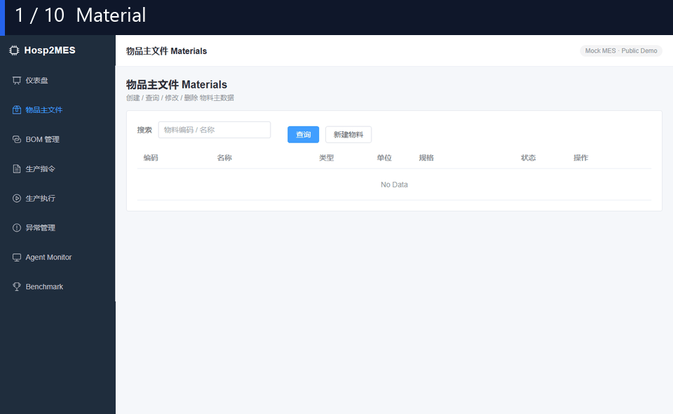
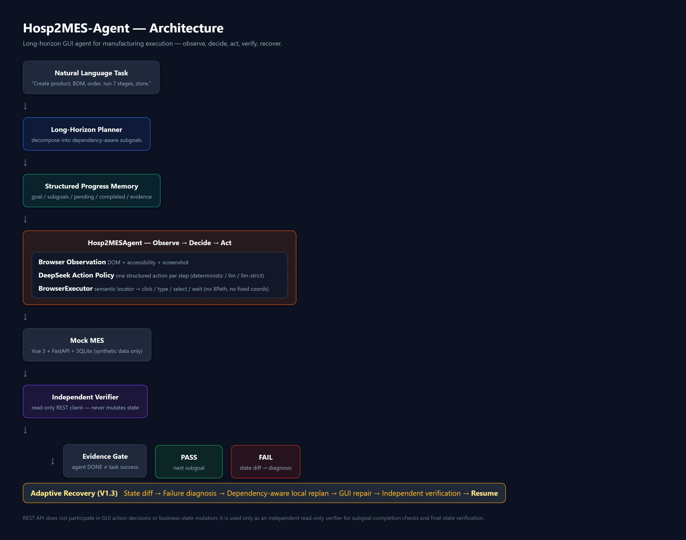

# Hosp2MES-Agent

> A long-horizon GUI agent for Manufacturing Execution Systems (MES).

Hosp2MES-Agent enables LLM agents to autonomously execute multi-page
manufacturing workflows through real browser GUIs, with structured progress
memory, evidence-based verification and state-diff local recovery.



[](../../actions)


## ✨ Key Features

### 🏭 Long-Horizon GUI Execution

`Material → BOM → Production Order → 7 Production Stages → Storage` — full
multi-page Vue workflow driven through real Chromium (Playwright), not a
mocked API.

### 🧠 Real LLM Decision Loop

`Observation → DeepSeek → ONE GUI Action → Execute → Observe again`. Each step
carries a `policy_source` (deterministic / deepseek), `llm_model`,
`llm_latency_ms` and `decision_rationale`. No pre-written action lists.

### 🛡️ Evidence-Gated Completion

`Agent DONE ≠ Task Success`. The agent only passes when the independent
read-only verifier (REST) confirms the live business state matches the
expected final state.

### 🔁 Adaptive Recovery

`State diff → Failure diagnosis → Dependency-aware local replan → GUI repair
→ Independent verification → Resume`. A real BOM-discard fault is detected
and repaired without restarting the already-completed material subgoal.

## 🤔 Why Hosp2MES

### Conventional GUI Agent

```text
Task
  ↓
Observe
  ↓
Act
  ↓
LLM says DONE
```

Problems:
- long task progress is lost
- premature DONE goes undetected
- any failure forces a restart
- difficult to verify actual business completion

### Hosp2MES

```text
Task
  ↓
Plan (dependency-aware subgoals)
  ↓
Structured Progress Memory
  ↓
Observe → Decide → Act  (one action per step)
  ↓
Independent Verification
  ↓
Local Recovery  (state diff → replan → resume)
```

## 🏗️ Architecture



A short, dependency-aware plan feeds a **Hosp2MESAgent** loop that
combines a **Browser Observation** (DOM + accessibility + screenshot), a
**DeepSeek Action Policy** (one structured action per step) and a
**BrowserExecutor** (semantic locators, no XPath / fixed coordinates).
The agent drives a **Mock MES** (Vue 3 + FastAPI + SQLite). Every step
passes through an **Independent Verifier** (read-only REST). Failures go
through **Adaptive Recovery** (V1.3) without a full restart.

> REST API does not participate in GUI action decisions or
> business-state mutation; it is used only as an independent read-only
> verifier for subgoal-completion checks and final-state verification.

## ✅ Real Validation

### Long-Horizon Hero (`MES-DEMO-003`)

| metric | value |
|---|---|
| policy | `llm-strict` (real DeepSeek) |
| GUI steps | 31 |
| LLM calls | 31 (all `policy_source=deepseek`) |
| fallback | **0** |
| subgoals | 4 / 4 |
| final state | `material_exists=true`, `bom_exists=true`, `production_order_status=COMPLETED`, `storage_status=STORED` |

### Adaptive Recovery Hero (`MES-DEMO-RECOVERY-001`)

| metric | value |
|---|---|
| fault | `FAULT-BOM-001` (BOM discarded after creation, `discard_state_change` once, harness-injected — agent unaware) |
| policy | `llm-strict` (real DeepSeek) |
| diagnosis | `MISSING_PREREQUISITE` (`bom.exists` expected true / actual false) |
| local replan | `preserve create_material` · `reactivate create_bom` · `invalidate downstream` · `resume_from create_bom` |
| repair steps | 7 (only the repair episode) |
| `subgoal_execution_counts` | `{create_material:1, create_bom:2, create_production_order:1, execute_production:1}` |
| reexecuted completed subgoals | **0** (material was *never* re-run) |
| final state | all verified |

### Tests

**54 tests, all passing** — unit, GUI E2E, LLM policy modes, adaptive
recovery (state diff / diagnosis / dependency-aware replanning / real
execution counters / repair-episode boundaries), and premature-DONE metrics.

## 🚀 Quick Start

Requires **Python 3.10+**, **Node 20+**, and a single `playwright install
chromium` step. No LLM key is required for the deterministic smoke run;
DeepSeek runs need `LLM_API_KEY` in a local `.env` (git-ignored).

```bash
# 1. clone
git clone https://github.com/Ctrl-CV-Master/Hosp2MES-Agent-Public.git
cd Hosp2MES-Agent-Public

# 2. python env + backend deps
python -m venv .venv
.venv/Scripts/python.exe -m pip install -r backend/requirements.txt
.venv/Scripts/python.exe -m pip install playwright pytest
.venv/Scripts/python.exe -m playwright install chromium

# 3. frontend build (required for browser E2E)
cd frontend && npm ci && npm run build && cd ..

# 4. deterministic smoke (no LLM key)
.venv/Scripts/python.exe -m pytest tests/ -q
PYTHONPATH=.:backend .venv/Scripts/python.exe benchmark/e2e_probe.py

# 5. (optional) real DeepSeek Hero — needs LLM_API_KEY in .env
.venv/Scripts/python.exe run_llm_recovery.py --policy llm-strict
```

## 🤖 Agent Modes

| Agent | File | Decision |
|---|---|---|
| **SemanticSkillAgent** (skill baseline) | `hosp2mes/agents/skill_agent.py` | one **pre-written** semantic action list per subgoal (deterministic baseline) |
| **Hosp2MESAgent** (LLM action policy) | `hosp2mes/agents/hosp2mes_agent.py` | **one action per step** — `GOAL+SUBGOAL+MEMORY+OBSERVATION → policy → 1 action`. Three policy modes: `deterministic` / `llm` / `llm-strict` |
| **AgentS3Adapter** (external) | `hosp2mes/agents/agent_s3_adapter.py` | bridges the official [Agent S3](https://github.com/simular-ai/Agent-S) (Apache-2.0, `gui-agents`). **Adapter ready — runtime not yet evaluated** (needs LLM key + UI-TARS grounding endpoint) |

`Hosp2MESAgent` policy output is strictly structured and public-safe:

```json
{ "action": "click", "target": {"within": {"role": "row", "text": "称量"},
                              "role": "button", "name": "完成"},
  "value": null, "rationale": "short public rationale" }
```

No private chain-of-thought is emitted or stored.

## 📊 Benchmark

```bash
PYTHONPATH=.:backend .venv/Scripts/python.exe benchmark/e2e_probe.py
```

| task | mode | result | note |
|---|---|---|---|
| `MES-DEMO-001` | api | ✅ | create material |
| `MES-DEMO-002` | api | ✅ | BOM + production order |
| `MES-DEMO-003` (Hero) | api | ✅ | full workflow + local recovery (recovery=1) |
| `MES-DEMO-GUI-001` | browser | ✅ | material via Playwright |
| `MES-DEMO-003` (Hero) | browser | ✅ | Material→BOM→Order→7 stages→Storage via Playwright |
| `MES-DEMO-RECOVERY-001` | browser | ✅ | fault-injected adaptive recovery, DeepSeek `llm-strict` |

## 📂 Public Evidence

Full local artifacts are excluded from Git (each run produces dozens
of screenshots). Curated, sanitized evidence is published here:

- Long-Horizon Hero: [`examples/evidence/long_horizon_hero/`](examples/evidence/long_horizon_hero/)
  (`MES-DEMO-003-20260823T011158Z` — 31 deepseek decisions, 0 fallback, 4/4 subgoals)
- Adaptive Recovery Hero: [`examples/evidence/recovery_hero/`](examples/evidence/recovery_hero/)
  (`MES-DEMO-RECOVERY-001-20260823T042516Z` — fault → state diff → MISSING_PREREQUISITE → local replan → 7 repair steps → 0 reexecuted)

> Full artifacts are generated locally under `artifacts/runs/` and are
> intentionally excluded from Git. Re-export with
> `python scripts/export_evidence.py hero|recovery <run_id>`.

## 📁 Repository Structure

```text
hosp2mes/                    # agent framework
├── agents/                  # Skill baseline + LLM policy + Agent S3 adapter
├── state/                   # canonical business state + state diff
├── recovery/                # diagnosis + dependency-aware local replanning
├── executor/                # action schema + BrowserExecutor (Playwright)
├── observation/             # ApiEnv (REST) + BrowserEnv (Chromium)
├── planner/                 # dependency-aware subgoal planner
├── memory/                  # structured progress memory
├── verifier/                # evidence-gated completion
├── evidence/                # per-run JSON evidence
├── evaluation/              # end-to-end metrics
├── trace/                   # live Agent Monitor trace
└── llm.py                   # DeepSeek client

backend/
├── app/                     # Mock MES FastAPI (Vue targets these endpoints)
└── requirements.txt

frontend/                    # Vue 3 + Vite Mock MES (built into dist/)
tests/                       # 54 pytest tests
benchmark/
├── tasks/                   # .yaml task definitions
├── e2e_probe.py             # api benchmark
└── results/                 # run reports

examples/evidence/           # PUBLIC, sanitized evidence (committed)
scripts/                     # run_*.py runners, export_evidence.py, build_demo_gif.py, build_architecture.py
artifacts/                   # LOCAL ONLY (gitignored)
.github/workflows/ci.yml     # CI: unit + api e2e + frontend build + browser e2e
```

## 📚 Documentation

- [DEVELOPMENT_STATUS.md](DEVELOPMENT_STATUS.md) — living log of every
  phase (Plan → Run → Test → Inspect → Fix → Retest → Document), with
  honest pass/fail records.
- [AUTONOMY_AUDIT.md](AUTONOMY_AUDIT.md) — guarantees there is no
  task-specific control flow in the browser agent.
- [LONG_HORIZON_CONTEXT_AUDIT.md](LONG_HORIZON_CONTEXT_AUDIT.md) — bounded
  per-step context (no unbounded history accumulation).
- [PORTFOLIO_AUDIT.md](PORTFOLIO_AUDIT.md) — 30-second HR / 3-minute
  engineer / resume-claim audits.

## ⚠️ Known Limitations

- **Mock MES** — synthetic data only. No real hospital / factory
  connection. Do not claim "production-ready industrial agent".
- **Single environment** — Mock MES lives in a single FastAPI + SQLite
  process. Multi-tenant / multi-site is out of scope.
- **Real DeepSeek runs need your own key** — the repo does not commit
  `.env`. Use `llm-strict` to ensure deterministic, auditable results.
- **Agent S3 adapter** — `gui-agents` (Apache-2.0) is installed and the
  adapter is constructed, but a real `predict()` requires a worker
  LLM key **and** a UI-TARS grounding model endpoint (not evaluated).
- **Recovery demo is state-diff local re-planning** in a single
  fault-injection scenario, not a general-purpose self-healing agent.

## 📄 License

MIT — see [LICENSE](LICENSE).

---

<sub>Built with the Mesop M-series (MiniMax M3). All data is synthetic.</sub>
